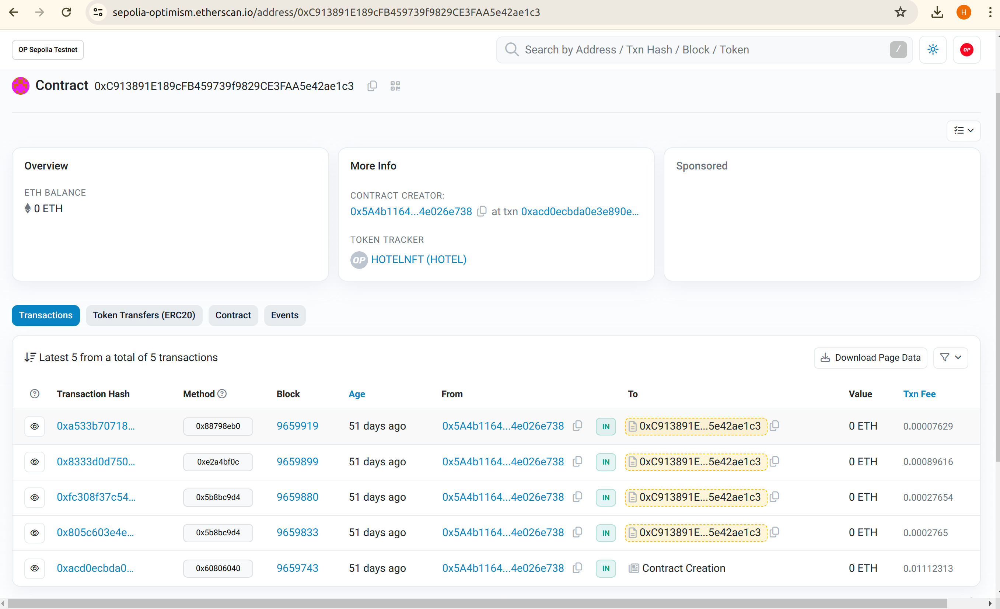

<h1 align="center"> 
</h1>

## HackaMaster Team
# Project BlockStay

<p><a href="https://github.com/DevSoniaBatista/hackNearx-BlockStay">
GitHub
</a></p>

<p><a href="https://www.youtube.com/watch?v=xanV5_8dIoc">
PITCH e Demo (Youtube)
</a></p>

<p><a href="./doc/fluxo.jpeg">
Flow of Operations
</a></p>

<p><a href="./doc/WhitePaper.md">
White Paper
</a></p>

<p><a href="./doc/initialversion-WebPage-BlockStay.png">
Web Page (initial version)
</a></p>


This Solidity code creates a smart contract named BlockStayNFT to handle hotel bookings as non-fungible tokens (NFTs) on the Ethereum blockchain. The goal of this project is to establish a platform for selling hotel accommodations using blockchain technology to ensure transaction security, transparency, and integrity. The platform will enable users to purchase accommodation packages, make secure payments, and receive an exclusive NFT as a reservation proof, which will be used during check-in. Here's a simplified explanation:

<b>Contract Setup:</b> The contract sets up the necessary environment for managing hotel bookings.

<b>Rooms and Bookings:</b> It allows the hotel owner to create rooms and make bookings for those rooms.

<b>Guest Interaction:</b>Guests can claim and pay for bookings using cryptocurrency.

<b>Booking Management:</b> The contract handles various aspects of booking management such as confirmation, cancellation, check-in, and check-out.

<b>NFT Representation: </b>Each booking is represented as a unique NFT, allowing guests to have a verifiable digital record of their reservation.

<b>Events:</b> The contract emits events to notify external systems about various contract interactions.

<b>Security Measures:<b> It includes security measures to ensure that only authorized parties can perform specific actions, such as the hotel owner managing bookings.

Overall, this contract acts as a decentralized booking system, providing transparency and security to both the hotel and its guests.

### CONTRACT ADDRESS Deployed at Optimism Sepolia
0x1c679a3Abb9a09450a141b5e434d11146DaF7D55
### Explorer Scan
https://sepolia.etherscan.io/address/0x1c679a3Abb9a09450a141b5e434d11146DaF7D55




### Tools
 - Foundry
 - Smart Contract => Solidity 
 - Front-end (nextjs)

### How execute
```bash
#clone the project
git clone https://github.com/DevSoniaBatista/oly-polygon.git
```

```bash
#enter directory
cd oly-polygon
```

```bash
#install dependencies
yarn install
```
 
To run locally, open 3 terminals:

On a first terminal, execute hardhat
```bash
#execute hardhat locally
cd package/hardhat
yarn chain
```

On a second terminal, deploy the contract:
```bash
#deploy the contract locally
cd package/hardhat
yarn generate
yarn deploy 
```

On the file: packages/nextjs/scaffold.config.ts change the line 13:
From: targetNetworks: [chains.polygonZkEvmCardona],
To:   targetNetworks: [chains.hardhat],

On a third terminal, start DApp:
```bash
#Launch the DApp
cd package/nextjs
yarn start 
```

It will open the interface web at http://localhost:3000

<hr/>

## HackaMaster Team
*Angelino Gonsalves / Desenvolvedor

*Sonia Mara Batista / Desenvolvedora

*Vanessa G. Dalanezi / Gestão de Produto 
